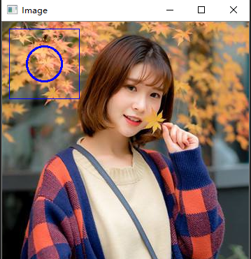
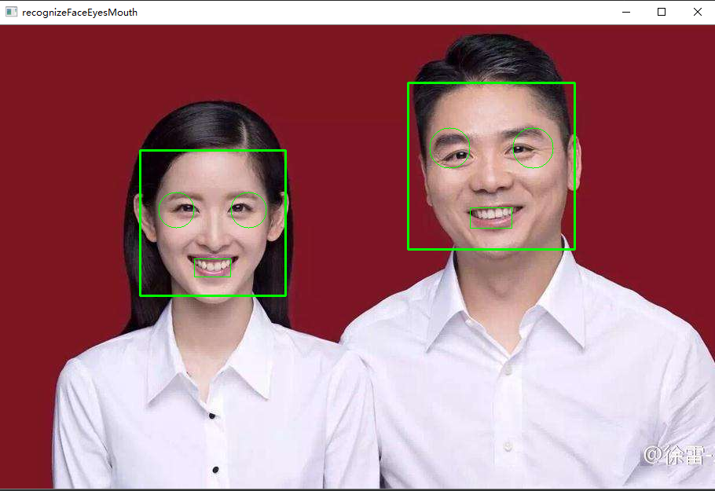
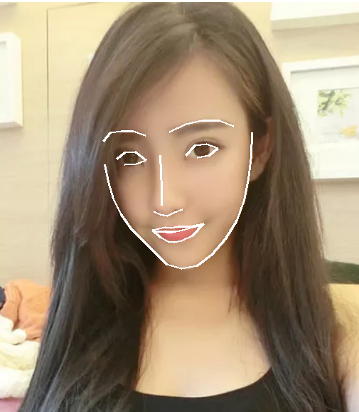

# Python test

> 学习地址：https://github.com/vipstone/faceai & https://github.com/ageitgey/face_recognition

## 一、安装python过程

(一)、下载安装python

点击进入，下载地址：https://www.python.org/downloads/

下载 `python-3.6.8-amd64.exe` 进行安装，一直点击下一步即可。

(二)、配置环境python变量

编辑系统变量（我的电脑右键属性 => 高级 => 环境变量 => 系统变量），在系统的path变量中添加4个变量目录，假设python3的安装目录为：E:\Program Files\Python\Python36，分别添加：“E:\Program Files\Python\Python36”、“E:\Program Files\Python\Python36\Scripts”。

(三)、安装python3的pip

使用命令：

```bash
python -m pip install -U pip

# 显示如下表示成功

Collecting pip
  Using cached https://files.pythonhosted.org/packages/54/0c/d01aa759fdc501a58f431eb594a17495f15b88da142ce14b5845662c13f3/pip-20.0.2-py2.py3-none-any.whl
Installing collected packages: pip
  Found existing installation: pip 18.1
    Uninstalling pip-18.1:
      Successfully uninstalled pip-18.1
Successfully installed pip-20.0.2

# 或

Collecting pip
  Downloading https://files.pythonhosted.org/packages/54/0c/d01aa759fdc501a58f431eb594a17495f15b88da142ce14b5845662c13f3/pip-20.0.2-py2.py3-none-any.whl (1.4MB)
    100% |████████████████████████████████| 1.4MB 7.8kB/s
Installing collected packages: pip
  Found existing installation: pip 19.0.3
    Uninstalling pip-19.0.3:
      Successfully uninstalled pip-19.0.3
Successfully installed pip-20.0.2
```

这样设置之后，就可以分别使用命令： `pip3` 和 `python3` 了。

以下我没配置，不做评论

~~(四)、使用vscode运行python程序~~

~~1、打开vscode安装插件“python”重启vscode.~~

~~2、设置vscode中调试的python路径，用户设置（文件 => 首选项 => 设置）添加：~~

~~"python.pythonPath": "C:/Python36/python3"~~

~~3、进入调试界面 => 添加配置 => 选中python（模块），选中配置名：Integrated Terminal/Console~~

~~4、F5直接运行代码~~

---

## 二、安装numpy模块

根据上文提示，现在我们已经正确安装了python和pip（安装和管理python包的工具），在正式安装OpenCV之前，首先我们要安装numpy模块。 numpy：是一个定义了数值数组和矩阵类型和它们的基本运算的语言扩展，OpenCV引用了numpy模块，所以安装OpenCV之前必须安装numpy。

本文安装python模块使用的是.whl文件安装的。

whl文件是什么？

whl是一个python的压缩包，其中包含了py文件以及经过编译的pyd文件。

第1步：先去网站下载对应的numpy版本，下载地址：https://www.lfd.uci.edu/~gohlke/pythonlibs/#numpy 本人是64为系统python3.6所以对应的最新版本是：numpy-1.18.1+mkl-cp36-cp36m-win_amd64.whl，点击下载到 `D:\11download\browser` 目录。

百度云链接：https://pan.baidu.com/s/10RefansrC4_0zsNehjyKTg

提取密码：gua3

第2步：启动命令窗体运行

```bash
# 本来应该是这句但是下载两天不下五次都没下载好那就算了，用后面一句。
pip3 install D:\11download\browser\numpy-1.18.1+mkl-cp36-cp36m-win_amd64.whl

pip3 install D:\11download\browser\numpy-1.18.1-cp36-cp36m-win_amd64.whl
Processing d:\11download\browser\numpy-1.18.1-cp36-cp36m-win_amd64.whl
Installing collected packages: numpy
Successfully installed numpy-1.18.1

# 命令窗体如下显示，说明已经安装成功。

Processing d:\11download\browser\numpy-1.18.1+mkl-cp36-cp36m-win_amd64.whl
Installing collected packages: numpy
Successfully installed numpy-1.18.1+mkl

# 若如下显示，重新下载对应python版本的numpy，cp38表示版本号为3.8，不适合。

ERROR: numpy-1.18.1+mkl-cp38-cp38-win_amd64.whl is not a supported wheel on this platform.

# 卸载

pip3 uninstall numpy

# 卸载成功

Found existing installation: numpy 1.18.1+mkl
Uninstalling numpy-1.18.1+mkl:
  Would remove:
    e:\program files\python\python37\lib\site-packages\numpy-1.18.1+mkl.dist-info\*
    e:\program files\python\python37\lib\site-packages\numpy\*
    e:\program files\python\python37\scripts\f2py.exe
Proceed (y/n)? y
  Successfully uninstalled numpy-1.18.1+mkl
```

---

## 三、安装OpenCV

同样安装OpenCV模块和numpy方式类似。

第1步：首先去网站下载OpenCV对应的.whl版本压缩包，网址：https://www.lfd.uci.edu/~gohlke/pythonlibs/#opencv 本人下载的版本是：opencv_python‑3.4.1‑cp36‑cp36m‑win_amd64.whl 64位系统对应python3.6的，下载到d盘根目录。

百度云链接：https://pan.baidu.com/s/10RefansrC4_0zsNehjyKTg

提取密码：gua3

第2步：启动命令窗体运行

```bash
# 安装

pip3 install D:\11download\browser\opencv_python-4.2.0-cp36-cp36m-win_amd64.whl

# 命令窗体如下显示，说明已经安装成功。

Processing d:\11download\browser\opencv_python-4.2.0-cp36-cp36m-win_amd64.whl
Installing collected packages: opencv-python
Successfully installed opencv-python-4.2.0

# 卸载

pip3 uninstall opencv-python

# 卸载成功

Found existing installation: opencv-python 4.2.0
Uninstalling opencv-python-4.2.0:
  Would remove:
    e:\program files\python\python37\lib\site-packages\cv.py
    e:\program files\python\python37\lib\site-packages\cv2.cp37-win_amd64.pyd
    e:\program files\python\python37\lib\site-packages\opencv.license
    e:\program files\python\python37\lib\site-packages\opencv.license-3rd-party
    e:\program files\python\python37\lib\site-packages\opencv_python-4.2.0.dist-info\*
    e:\program files\python\python37\lib\site-packages\opencv_videoio_ffmpeg420_64.dll
    e:\program files\python\python37\opencv_videoio_ffmpeg420_64.dll
Proceed (y/n)? y
  Successfully uninstalled opencv-python-4.2.0
```

---

## 四、准备dlib

### 1.安装dlib

下载地址：https://pypi.org/simple/dlib/ 选择适合你的版本，本人配置：

Window 10 + Python 3.6.8

我现在的版本是：dlib-19.8.1-cp36-cp36m-win_amd64.whl

使用命令安装：

pip3 install D:\11download\browser\dlib-19.8.1-cp36-cp36m-win_amd64.whl
Processing d:\11download\browser\dlib-19.8.1-cp36-cp36m-win_amd64.whl
Installing collected packages: dlib
Successfully installed dlib-19.8.1

为安装成功。

### 2.下载训练模型

训练模型用于是人脸识别的关键，用于查找图片的关键点。

下载地址：http://dlib.net/files/

下载文件：shape_predictor_68_face_landmarks.dat.bz2

存放到：E:\Program Files\Python\Python36\Lib\site-packages\dlib-data\shape_predictor_68_face_landmarks.dat.bz2

解压：shape_predictor_68_face_landmarks.dat.bz2得到文件：shape_predictor_68_face_landmarks.dat

---

## 五、几段代码

## (一)、图片人脸检测（OpenCV）

[recognizeFaceEyeMouth(OpenCV).py](./recognizeFaceEyeMouth(OpenCV).py)

```python
import cv2

# 1.读取并展示图像片段
filepath = "img/meinv.png"
img = cv2.imread(filepath)
cv2.namedWindow('Image')
cv2.imshow('Image', img)
cv2.waitKey(0)
cv2.destroyAllWindows()
```

效果图：


```python
import cv2

# 2.图片转换成灰色
filepath = "img/meinv.png"
img = cv2.imread(filepath)
# 转换灰色
gray = cv2.cvtColor(img, cv2.COLOR_BGR2GRAY)
# 显示图像
cv2.imshow("Image", gray)
cv2.waitKey(0)
cv2.destroyAllWindows()
```

效果图：


```python
import cv2

# 3.图片上画矩形和圆
filepath = "img/meinv.png"
img = cv2.imread(filepath)  # 读取图片
gray = cv2.cvtColor(img, cv2.COLOR_BGR2GRAY)  # 转换灰色
x = y = 10  # 坐标
w = 100  # 矩形大小（宽、高）
color = (255, 0, 0)  # 定义绘制颜色（BGR而非RGB）
cv2.rectangle(img, (x, y), (x + w, y + w), color, 1)  # 绘制矩形
cv2.circle(img, (x + w // 2, y + w // 2 ), w // 4, color, 2) # 绘制圆
cv2.imshow("Image", img)  # 显示图像
cv2.waitKey(0)
cv2.destroyAllWindows()  # 释放所有的窗体资源
```

效果图：



```python
import cv2

# 4.使用训练分类器查找人脸
filepath = "img/ncm&lqd.jpg"

img = cv2.imread(filepath)  # 读取图片
gray = cv2.cvtColor(img, cv2.COLOR_BGR2GRAY)  # 转换灰色

# OpenCV人脸识别分类器
classifier = cv2.CascadeClassifier(
    "E:\Program Files\Python\Python36\Lib\site-packages\opencv-master\data\haarcascades\haarcascade_frontalface_default.xml"
)
color = (0, 255, 0)  # 定义绘制颜色
# 调用识别人脸
faceRects = classifier.detectMultiScale(
    gray, scaleFactor=1.2, minNeighbors=3, minSize=(32, 32))
if len(faceRects):  # 大于0则检测到人脸
    for faceRect in faceRects:  # 单独框出每一张人脸
        x, y, w, h = faceRect
        # 框出人脸
        cv2.rectangle(img, (x, y), (x + h, y + w), color, 2)
        # 左眼
        cv2.circle(img, (x + w // 4, y + h // 4 + 30), min(w // 8, h // 8),
                   color)
        #右眼
        cv2.circle(img, (x + 3 * w // 4, y + h // 4 + 30), min(w // 8, h // 8),
                   color)
        #嘴巴
        cv2.rectangle(img, (x + 3 * w // 8, y + 3 * h // 4),
                      (x + 5 * w // 8, y + 7 * h // 8), color)

cv2.imshow("recognizeFaceEyesMouth", img)  # 显示图像
c = cv2.waitKey(10)

cv2.waitKey(0)
cv2.destroyAllWindows()
```

效果图：



---

## (二)、图片人脸检测(Dlib版)

[recognize68landmarks(dlib).py](./recognize68landmarks(dlib).py)

```python
# coding=utf-8

import cv2
import dlib

path = "img/ncm&lqd.png"
img = cv2.imread(path)
gray = cv2.cvtColor(img, cv2.COLOR_BGR2GRAY)

#人脸分类器
detector = dlib.get_frontal_face_detector()
# 获取人脸检测器
predictor = dlib.shape_predictor(
    "E:\\Program Files\\Python\\Python36\\Lib\\site-packages\\dlib-data\\shape_predictor_68_face_landmarks.dat"
)

dets = detector(gray, 1)
for face in dets:
    shape = predictor(img, face)  # 寻找人脸的68个标定点
    # 遍历所有点，打印出其坐标，并圈出来
    for pt in shape.parts():
        pt_pos = (pt.x, pt.y)
        cv2.circle(img, pt_pos, 2, (0, 255, 0), 1)
    cv2.imshow("image", img)

cv2.waitKey(0)
cv2.destroyAllWindows()
```

效果图：


---

## (三)、视频人脸检测(OpenCV版)

[video(OpenCV).py](./video(OpenCV).py)

```py
# -*- coding:utf-8 -*-
# OpenCV版本的视频检测
import cv2

# 图片识别方法封装
def discern(img):
    gray = cv2.cvtColor(img, cv2.COLOR_BGR2GRAY)
    cap = cv2.CascadeClassifier(
        "E:\Program Files\Python\Python36\Lib\site-packages\opencv-master\data\haarcascades\haarcascade_frontalface_default.xml"
    )
    faceRects = cap.detectMultiScale(
        gray, scaleFactor=1.2, minNeighbors=3, minSize=(50, 50))
    if len(faceRects):
        for faceRect in faceRects:
            x, y, w, h = faceRect
            cv2.rectangle(img, (x, y), (x + h, y + w), (0, 255, 0), 2)  # 框出人脸
    cv2.imshow("Image", img)


# 获取摄像头0表示第一个摄像头
cap = cv2.VideoCapture(0)
while (1):  # 逐帧显示
    ret, img = cap.read()
    # cv2.imshow("Image", img)
    discern(img)
    if cv2.waitKey(1) & 0xFF == ord('q'):
        break
cap.release()  # 释放摄像头
cv2.destroyAllWindows()  # 释放窗口资源
```

效果图：

.gif)

---

## (四)、视频人脸检测(Dlib版)

[video(dlib).py](./video(dlib).py)

```py
# coding=utf-8
import cv2
import dlib

detector = dlib.get_frontal_face_detector()  #使用默认的人类识别器模型


def discern(img):
    gray = cv2.cvtColor(img, cv2.COLOR_BGR2GRAY)
    dets = detector(gray, 1)
    for face in dets:
        left = face.left()
        top = face.top()
        right = face.right()
        bottom = face.bottom()
        cv2.rectangle(img, (left, top), (right, bottom), (0, 255, 0), 2)
        cv2.imshow("image", img)


cap = cv2.VideoCapture(0)
while (1):
    ret, img = cap.read()
    discern(img)
    if cv2.waitKey(1) & 0xFF == ord('q'):
        break

cap.release()
cv2.destroyAllWindows()
```

那么，OpenCV和Dlib的视频识别对比，有两个地方是不同的：

1.Dlib模型识别的准确率和效果要好于OpenCV；

2.Dlib识别的性能要比OpenCV差，使用视频测试的时候Dlib有明显的卡顿，但是OpenCV就好很多，基本看不出来；

效果图：

.gif)

---

## (五)、脸部轮廓绘制(face_recognition)

[outline_face_recognition(FR).py](./outline_face_recognition(FR).py)

安装 `face_recognition`

```bash
pip install face_recognition
```

由于以上操作老是失败，我用了以下操作（学习自https://blog.csdn.net/anshidashen/article/details/100865206）

此处 https://pypi.org/project/face_recognition_models/#files 下载并解压 `face_recognition_models-0.3.0.tar.gz`

执行以下两步操作

```bash
python setup.py build
python setup.py install
```

<details>
<summary>效果如下</summary>

```bash
Microsoft Windows [版本 10.0.18362.476]
(c) 2019 Microsoft Corporation。保留所有权利。

D:\3Thunder download\face_recognition_models-0.3.0>python setup.py build
running build
running build_py
creating build
creating build\lib
creating build\lib\face_recognition_models
copying face_recognition_models\__init__.py -> build\lib\face_recognition_models
creating build\lib\face_recognition_models\models
copying face_recognition_models\models\dlib_face_recognition_resnet_model_v1.dat -> build\lib\face_recognition_models\models
copying face_recognition_models\models\mmod_human_face_detector.dat -> build\lib\face_recognition_models\models
copying face_recognition_models\models\shape_predictor_5_face_landmarks.dat -> build\lib\face_recognition_models\models
copying face_recognition_models\models\shape_predictor_68_face_landmarks.dat -> build\lib\face_recognition_models\models

D:\3Thunder download\face_recognition_models-0.3.0>python setup.py install
running install
running bdist_egg
running egg_info
writing face_recognition_models.egg-info\PKG-INFO
writing dependency_links to face_recognition_models.egg-info\dependency_links.txt
writing top-level names to face_recognition_models.egg-info\top_level.txt
reading manifest file 'face_recognition_models.egg-info\SOURCES.txt'
reading manifest template 'MANIFEST.in'
warning: no files found matching 'AUTHORS.rst'
warning: no files found matching 'CONTRIBUTING.rst'
warning: no files found matching 'HISTORY.rst'
warning: no files found matching '*' under directory 'tests'
warning: no previously-included files matching '__pycache__' found under directory '*'
warning: no previously-included files matching '*.py[co]' found under directory '*'
warning: no files found matching '*.rst' under directory 'docs'
warning: no files found matching 'conf.py' under directory 'docs'
warning: no files found matching 'Makefile' under directory 'docs'
warning: no files found matching 'make.bat' under directory 'docs'
warning: no files found matching '*.jpg' under directory 'docs'
warning: no files found matching '*.png' under directory 'docs'
warning: no files found matching '*.gif' under directory 'docs'
writing manifest file 'face_recognition_models.egg-info\SOURCES.txt'
installing library code to build\bdist.win-amd64\egg
running install_lib
running build_py
creating build\bdist.win-amd64
creating build\bdist.win-amd64\egg
creating build\bdist.win-amd64\egg\face_recognition_models
creating build\bdist.win-amd64\egg\face_recognition_models\models
copying build\lib\face_recognition_models\models\dlib_face_recognition_resnet_model_v1.dat -> build\bdist.win-amd64\egg\face_recognition_models\models
copying build\lib\face_recognition_models\models\mmod_human_face_detector.dat -> build\bdist.win-amd64\egg\face_recognition_models\models
copying build\lib\face_recognition_models\models\shape_predictor_5_face_landmarks.dat -> build\bdist.win-amd64\egg\face_recognition_models\models
copying build\lib\face_recognition_models\models\shape_predictor_68_face_landmarks.dat -> build\bdist.win-amd64\egg\face_recognition_models\models
copying build\lib\face_recognition_models\__init__.py -> build\bdist.win-amd64\egg\face_recognition_models
byte-compiling build\bdist.win-amd64\egg\face_recognition_models\__init__.py to __init__.cpython-36.pyc
creating build\bdist.win-amd64\egg\EGG-INFO
copying face_recognition_models.egg-info\PKG-INFO -> build\bdist.win-amd64\egg\EGG-INFO
copying face_recognition_models.egg-info\SOURCES.txt -> build\bdist.win-amd64\egg\EGG-INFO
copying face_recognition_models.egg-info\dependency_links.txt -> build\bdist.win-amd64\egg\EGG-INFO
copying face_recognition_models.egg-info\not-zip-safe -> build\bdist.win-amd64\egg\EGG-INFO
copying face_recognition_models.egg-info\top_level.txt -> build\bdist.win-amd64\egg\EGG-INFO
creating dist
creating 'dist\face_recognition_models-0.3.0-py3.6.egg' and adding 'build\bdist.win-amd64\egg' to it
removing 'build\bdist.win-amd64\egg' (and everything under it)
Processing face_recognition_models-0.3.0-py3.6.egg
creating e:\program files\python\python36\lib\site-packages\face_recognition_models-0.3.0-py3.6.egg
Extracting face_recognition_models-0.3.0-py3.6.egg to e:\program files\python\python36\lib\site-packages
Adding face-recognition-models 0.3.0 to easy-install.pth file

Installed e:\program files\python\python36\lib\site-packages\face_recognition_models-0.3.0-py3.6.egg
Processing dependencies for face-recognition-models==0.3.0
Finished processing dependencies for face-recognition-models==0.3.0

D:\3Thunder download\face_recognition_models-0.3.0>
```

</details>


即可安装成功 `face-recognition-models==0.3.0`

安装PIL

```bash
pip install Pillow 

Collecting Pillow
  Using cached Pillow-7.0.0-cp36-cp36m-win_amd64.whl (2.0 MB)
ERROR: face-recognition 1.2.3 requires Click>=6.0, which is not installed.
Installing collected packages: Pillow
Successfully installed Pillow-7.0.0
```

上面报错说要安装Click

```bash
pip install Click
Collecting Click
  Downloading Click-7.0-py2.py3-none-any.whl (81 kB)
     |████████████████████████████████| 81 kB 10 kB/s
Installing collected packages: Click
Successfully installed Click-7.0
```

描绘轮廓

```py
#coding=utf-8
#绘制面部轮廓
import face_recognition
from PIL import Image, ImageDraw

# 将图片文件加载到numpy 数组中
image = face_recognition.load_image_file("img/ag.png")

#查找图像中所有面部的所有面部特征
face_landmarks_list = face_recognition.face_landmarks(image)

for face_landmarks in face_landmarks_list:
    facial_features = [
        'chin', 'left_eyebrow', 'right_eyebrow', 'nose_bridge', 'nose_tip',
        'left_eye', 'right_eye', 'top_lip', 'bottom_lip'
    ]
    pil_image = Image.fromarray(image)
    d = ImageDraw.Draw(pil_image)
    for facial_feature in facial_features:
        d.line(face_landmarks[facial_feature], fill=(255, 255, 255), width=3)
    pil_image.show()
```

**注意**上面这段代码文件名不能保存为 `face_recognition.py` ，否则会报错，因为导入的 `face_recognition` 不对。参考：https://github.com/ageitgey/face_recognition/issues/318

效果图：



---

## (六)、从照片中找出人脸(FR)

[findFaceInPic(FR).py](./findFaceInPic(FR).py)

```py
from PIL import Image
import face_recognition

# Load the jpg file into a numpy array
image = face_recognition.load_image_file("img/ncm&lqd.jpg")

# Find all the faces in the image using the default HOG-based model.
# This method is fairly accurate, but not as accurate as the CNN model and not GPU accelerated.
# See also: find_faces_in_picture_cnn.py
face_locations = face_recognition.face_locations(image)

print("I found {} face(s) in this photograph.".format(len(face_locations)))

for face_location in face_locations:

    # Print the location of each face in this image
    top, right, bottom, left = face_location
    print("A face is located at pixel location Top: {}, Left: {}, Bottom: {}, Right: {}".format(top, left, bottom, right))

    # You can access the actual face itself like this:
    face_image = image[top:bottom, left:right]
    pil_image = Image.fromarray(face_image)
    pil_image.show()
```

效果图：


OUTPUT：

```bash
I found 2 face(s) in this photograph.
A face is located at pixel location Top: 118, Left: 531, Bottom: 304, Right: 716
A face is located at pixel location Top: 180, Left: 180, Bottom: 366, Right: 366
```

---

## (七)、比较已知图片和未知图片(FR)

[recognizeFaceInPic(FR).py](./recognizeFaceInPic(FR).py)

```py
import face_recognition

# Load the jpg files into numpy arrays
biden_image = face_recognition.load_image_file("img/biden.jpg")
obama_image = face_recognition.load_image_file("img/obama.jpg")
unknown_image = face_recognition.load_image_file("img/obama2.jpg")

# Get the face encodings for each face in each image file
# Since there could be more than one face in each image, it returns a list of encodings.
# But since I know each image only has one face, I only care about the first encoding in each image, so I grab index 0.
try:
    biden_face_encoding = face_recognition.face_encodings(biden_image)[0]
    obama_face_encoding = face_recognition.face_encodings(obama_image)[0]
    unknown_face_encoding = face_recognition.face_encodings(unknown_image)[0]
except IndexError:
    print("I wasn't able to locate any faces in at least one of the images. Check the image files. Aborting...")
    quit()

known_faces = [
    biden_face_encoding,
    obama_face_encoding
]

# results is an array of True/False telling if the unknown face matched anyone in the known_faces array
results1 = face_recognition.compare_faces(known_faces, unknown_face_encoding)
results2 = face_recognition.face_distance(known_faces, unknown_face_encoding)

print("Is the unknown face a picture of Biden? {}".format(results1[0]))
print("Is the unknown face a picture of Obama? {}".format(results1[1]))
print("Is the unknown face a new person that we've never seen before? {}".format(not True in results1))

print("What't the distance between the unknown face & Biden? {}".format(results2[0]))
print("What't the distance between the unknown face & Obama? {}".format(results2[1]))
```

OUTPUT:

```
Is the unknown face a picture of Biden? False
Is the unknown face a picture of Obama? True
Is the unknown face a new person that we've never seen before? False
What't the distance between the unknown face & Biden? 0.8158407200335561
What't the distance between the unknown face & Obama? 0.34573490066247703
```

---

## (八)、实时视频中识别人脸并给出名字(FR)

[identifyNameFromVideo(FR).py](./identifyNameFromVideo(FR).py)

参考:

https://github.com/ageitgey/face_recognition#identify-faces-in-pictures & https://github.com/ageitgey/face_recognition/blob/master/examples/facerec_from_webcam_faster.py

电脑太差没带动 :dizzy_face:

---

## 附

### 一些指令

```bash
# 显示python.exe路径

where python

# 显示python库路径

python -m site

# 用pip或pip3安装/卸载库

pip install ...
pip3 install ...

pip uninstall ...
pip3 uninstall ...

# 列出安装的库及其版本

pip list

```

### 用国内镜像安装依赖

使用python虽然导入库非常方便，但有时也会碰到许多的问题。下载速度有时候很慢。在网上找来了一个关于将python的pip调成寻找国内镜像的方法。

**国内镜像地址**

http://pypi.douban.com/simple/　　 豆瓣

http://mirrors.aliyun.com/pypi/simple/ 　　阿里

http://pypi.hustunique.com/simple/ 　　华中理工大学

http://pypi.sdutlinux.org/simple/ 　　山东理工大学

http://pypi.mirrors.ustc.edu.cn/simple/ 　　中国科学技术大学

https://pypi.tuna.tsinghua.edu.cn/simple 　　清华

 
**如何使用**

1、临时使用，添加“-i”或“--index”参数

```bash
pip install -i http://mirrors.aliyun.com/pypi/simple/ face_recognition
# or
pip install face_recognition -i http://mirrors.aliyun.com/pypi/simple
```

2、配制成默认的

在你的“C:\Users\你的用户名\”目录下创建“pip”目录，“pip”目录下创建“pip.ini”文件（注意：以UTF-8 无BOM格式编码）；

`pip.ini` 文件内容：

```
[global]

index-url=http://mirrors.aliyun.com/pypi/simple/

[install]

trusted-host=mirrors.aliyun.com
```
注意：trusted-host 选项为了避免麻烦是必须的，否则使用的时候会提示不受信任，或者添加 `--trusted-host=mirrors.aliyun.com` 选项